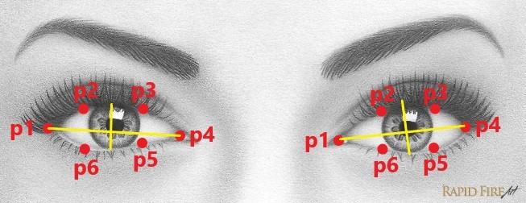

<div id="top"></div>
<div align="center">
  <a href="https://github.com/BSH2409/Minor_Project">
    
  </a>

<h3 align="center">IMPROVED METHODS OF DETECTION
AND PREVENTION OF ROAD
ACCIDENTS BY USING ML
TECHNIQUES</h3>

  <p align="center">
    project_description
    <br />
    <a href="https://github.com/BSH2409/Minor_Project"><strong>Explore the docs »</strong></a>
    <br />
    <br />
    <a href="https://github.com/BSH2409/Minor_Project">View Demo</a>
    ·
    <a href="https://github.com/BSH2409/Minor_Project/issues">Report Bug</a>
    ·
    <a href="https://github.com/BSH2409/Minor_Project/issues">Request Feature</a>
  </p>
</div>
<details>
  <summary>Table of Contents</summary>
  <ol>
    <li>
      <a href="#about-the-project">About The Project</a>
      <ul>
        <li><a href="#built-with">Built With</a></li>
      </ul>
    </li>
    <li>
      <a href="#getting-started">Getting Started</a>
      <ul>
        <li><a href="#prerequisites">Prerequisites</a></li>
        <li><a href="#installation">Installation</a></li>
      </ul>
    </li>
    <li><a href="#advantages">Advantages</a></li>
    <li><a href="#applications">Applications</a></li>
    <li><a href="#roadmap">Roadmap</a></li>
    <li><a href="#contributions">Contributing</a></li>
    <li><a href="#license">License</a></li>
    <li><a href="#contact">Contact</a></li>
    <li><a href="#acknowledgments">Acknowledgments</a></li>
  </ol>
</details>

## About The Project
<div align="center" id="about-the-project">

 </div>
The attention level of driver degrade because of less sleep, long continuous driving or any
other medical condition like brain disorders etc. Several surveys on road accidents says that
around 30 percent of accidents are caused by fatigue of the driver. When driver drives for
more than normal period for human then excessive fatigue is caused and also results in
tiredness which drives the driver to sleepy condition or loss of consciousness. Drowsiness is a
complex phenomenon which states that there is a decrease in alerts and conscious levels of
the driver. It might be caused by an absence of rest, medicine, substance misuse, or a
cerebral issue. It is mostly the result of fatigue which can be both mental and physical.
Physical fatigue, or muscle weariness, is the temporary physical failure of a muscle to
perform ideally. Mental fatigue is a temporary failure to keep up ideal psychological
execution.
Though there is no direct measure to detect the drowsiness but several indirect methods can
be used for this purpose.
Several measures are available for the measurement of drowsiness which includes the
following:
1. Vehicle based measures
2. Physiological measures
3. Behavioural measures

<h4>Proposed Method</h4>
We use the approach based on behavioural measures as this approach will be mostly
focusing on amount of eye closure also called (PERCLOS) percentage of closure as it
provides the most accurate information on drowsiness. It is also non-intrusive in nature,
hence does not affect the state of the driver and also the driver feels totally comfortable with
this system. Environmental factors like road condition does not affect this system. The case
of micro nap is also detected according the given threshold value. The development of this
system includes face identification and tracking, detection and location of the human eye,
human eye tracking, eye state detection, and driver fatigue testing. The key parts of the
detection framework fused the detection and location of human eyes and driver fatigue
testing.
<p align="right">(<a href="#top">↑</a>)</p>


### Built With
* [OpenCV](https://opencv.org)
* [Numpy](https://NumPy.org/)
* [Dlib](https://dlib.net/)
* [Imutils](https://github.com/PyImageSearch/imutils)
* [Pygame](https://pygame.org/)
* [Flask](https://flask.palletsprojects.com/en/2.0.x/)
* [Bootstrap](https://getbootstrap.com)
* [JQuery](https://jquery.com)

<p align="right">(<a href="#top">↑</a>)</p>


## Getting Started
This is an example of how you may give instructions on setting up your project locally.
To get a local copy up and running follow these simple example steps.

### Prerequisites
The requirement for this Python project is a webcam through which we will capture images.<br />
We need to have Python ([3.6](https://www.python.org/downloads/release/python-360/) version recommended) installed on your system.<br />
Any IDE would be good to run the project([Pycharm](https://www.jetbrains.com/pycharm/download/#section=windows) Recommended ).<br />
* check version of python installed
  ```sh
  py --version
  ```
Install [GitBash](https://git-scm.com/download/win) to clone the repo or just [download](https://github.com/BSH2409/Minor_Project/archive/refs/heads/main.zip) the repo.
* check version of git installed
  ```sh
  git --version
  ```

### Installation
1. Clone the repo
   ```sh
   git clone https://github.com/BSH2409/Minor_Project.git
   ```
2. Install pip packages 
  (Taking assumption that python was installed successfully)
  * OpenCV
  ```sh
  pip install opencv-python
  ```
  * Numpy
  ```sh
  pip install numpy
  ```
  * Dlib
  To install Dlib first install Cmake
  ```sh
  pip install cmake
  pip install dlib
  ```
  * imutils
  ```sh
  pip install imutils
  ```
  * Pygame
  ```sh
  pip install pygame
  ```
  * Flask
  ```sh
  pip install flask
  ```
3. Run the [app.py](https://github.com/BSH2409/Minor_Project/blob/main/app.py) in your IDE

Voilà, All Set.

<p align="right">(<a href="#top">↑</a>)</p>

## Advantages

• The detected abnormal behavior is corrected through alarms in real time.<br />
• Component establishes interface with other drivers very easily.<br />
• Life of the driver can be saved by alerting him using the alarm system.<br />
• Speed of the vehicle can be controlled.<br />
• Traffic management can be maintained by reducing accidents.<br />
• Practically applicable<br />

## Applications
• This system can be used in factories to alert the workers.<br />
• If found drowsy, the alarm system gets activated and the driver is alerted.<br />
• If there is any obstacles it is alerted to the driver.<br />
• This system can also be used for railway drivers.<br />

<p align="right">(<a href="#top">↑</a>)</p>


## Model BluePrint

The below image is an example of a Dlib's 68 points model. There we can see that points from 1 to 68. But sometimes we don't need all 68 feature points, then for that, we will use only the eye landmarks and customize those points according to our requirements.
<div align="center"></div><br />
We need to initialize dlib’s HOG + Linear SVM-based face detector and then load the facial landmark predictor from disk:

```sh
  detector = dlib.get_frontal_face_detector()
  predictor = dlib.shape_predictor("predictor\\shape_predictor_68_face_landmarks.dat")
```
For further References on Dlib visit : 
[Facial Landmark](https://www.pyimagesearch.com/2017/04/03/facial-landmarks-dlib-opencv-python/)

Drowsiness Classifier:
We use the EAR(Eye Aspect Ratio) to determine whether the user is active/drowsy/asleep.
We find the ratio of height and width of the eye to infer the open or close state of the eye.The ratio falls to approximately zero when the eye is close but remains constant when they are open.
<div align="center">
  <br />
  
 </div>


<p align="right">(<a href="#top">↑</a>)</p>

## Flow of the Program

<div align="center">
<br />
  </div>
<p align="right">(<a href="#top">↑</a>)</p>

## Contributions

This project is a result of teamwork and wouldn't be possible without their help and our mentor's guidance.

<p align="right">(<a href="#top">↑</a>)</p>

## License

<p align="right">(<a href="#top">↑</a>)</p>

## Contact

Bhartik Harchand - [Instagram](https://www.instagram.com/_._bsh_._/) - bsh.bhartik@gmail.com

Project Link: [https://github.com/BSH2409/Minor_Project](https://github.com/BSH2409/Minor_Project)

<p align="right">(<a href="#top">↑</a>)</p>


## References

* []()
* []()
* []()

<p align="right">(<a href="#top">↑</a>)</p>
